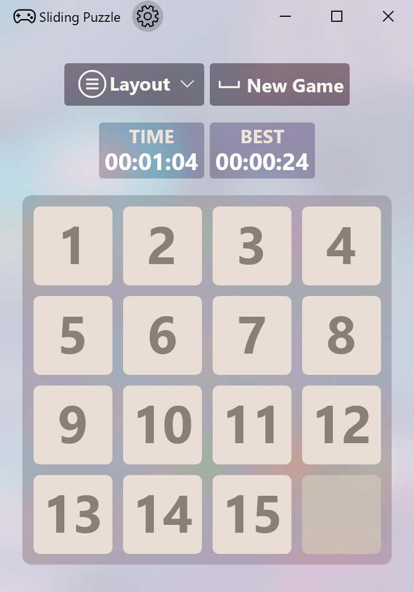

# Sliding Puzzle

This project is a UWP version of the classic game Sliding Puzzle with extended layouts (including 4 x 4, 5 x 5, 6 x 6) for Windows 10 platform; besides, keyboard, mouse, touchscreen and Xbox certified/compatible controller are all supported to play the game!

### How to Play
Use arrow keys/D-pad or swipe on screen to move tiles. Arrange all tiles in order to win!

## Minimum Build Requirements
* Microsoft Visual Studio 2019 IDE with Universal Windows Platform development workload installed
* Microsoft Windows 10 SDK (10.0.18362.0)

